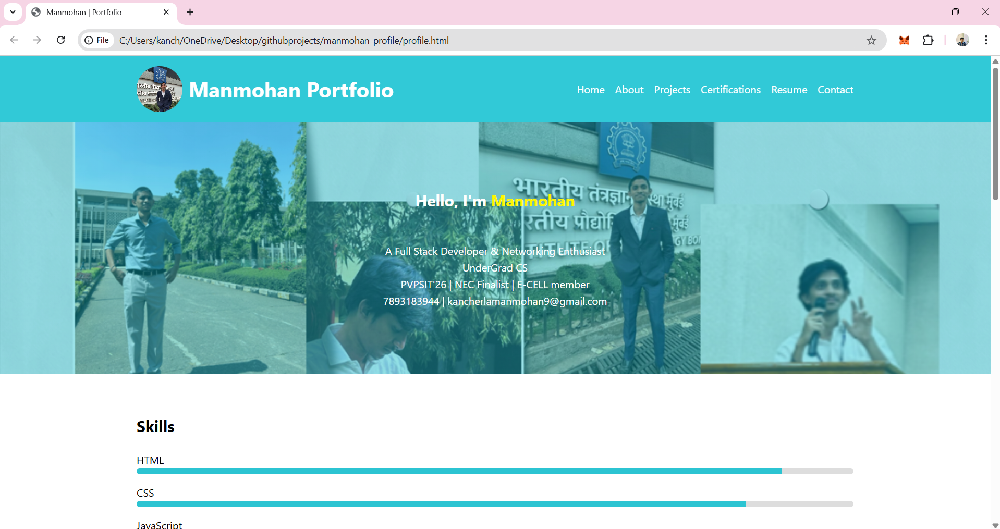

# Manmohan Portfolio

A personal portfolio website showcasing my skills, projects, education, certifications, interests, and more.  
I built this web-app using **HTML, CSS, and JavaScript**.  

---

# 🛠️ How I Built This Portfolio Web-App

### 1. Planning & Structure
- Defined key sections: **About Me, Skills, Education, Projects, Certifications, Hackathons, Resume, Contact**.  
- Designed a layout to clearly highlight my achievements and projects.  

---

### 2. Frontend Development
- Built using **HTML5, CSS3, and JavaScript**.  
- Implemented **responsive design** to ensure compatibility across mobile, tablet, and desktop devices.  
- Structured content into separate pages (e.g., `profile.html`, `projects.html`) for smooth navigation.  

---

### 3. Styling & UI Enhancements
- Applied **CSS Flexbox and Grid** for clean, structured layouts.  
- Added hover effects, icons, and smooth scrolling for an interactive user experience.  
- Maintained a **minimal and professional theme** to keep focus on content.  

---

### 4. Hosting & Deployment
- Pushed the source code to a **GitHub repository**.  
- Deployed using **Vercel**, which auto-builds and updates the site whenever changes are pushed.  
- 🌍 Live at: [manmohan-portfolio-owyg.vercel.app](https://manmohan-portfolio-owyg.vercel.app)  

---

## 📸 Screenshots

  
  

---

## 📌 Tech Stack
- **Frontend:** HTML5, CSS3, JavaScript  
- **Hosting & Deployment:** GitHub, Vercel  

---

## 🚀 Future Improvements
- Add a blog section with Markdown-based posts.  
- Integrate GitHub API to display latest projects dynamically.  
- Add dark/light mode toggle for better UX.  

---

## 📫 Contact
- **Email:** kancherlamanmohan9@gmail.com  
- **GitHub:** [Manmohangit123](https://github.com/Manmohangit123)  
- **LinkedIn:** [Manmohan Kancherla](https://www.linkedin.com/in/manmohan-kancherla/)  

---

© 2025 Manmohan · All rights reserved

